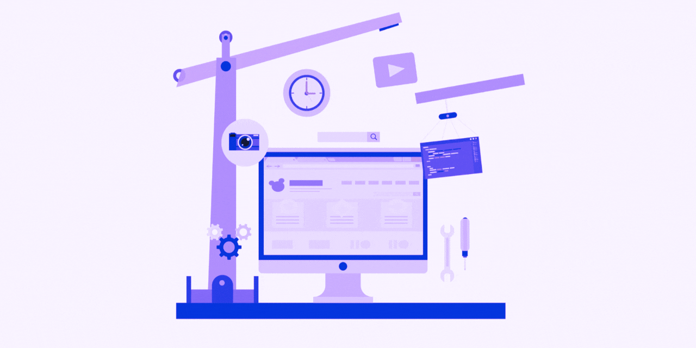

# Hola, soy Diana Guaiña 👋

<div align="center">
  
</div>

<p align="center">
  
</p>

<p align="center">
  
  
</p>

---

## 🚀 Sobre Mí


💡 **Desarrolladora apasionada** por crear soluciones tecnológicas innovadoras con experiencia en diversos proyectos que van desde chatbots inteligentes hasta sistemas de gestión de proyectos completos.

🎯 **Especializada en:** Desarrollo Frontend, Metodologías Ágiles, y Diseño UX/UI

📈 **Enfoque:** Desarrollo centrado en el negocio y experiencia del usuario

```javascript
const dinessa = {
    role: "Full Stack Developer",
    location: "🌎 Ecuador",
    languages: ["JavaScript", "TypeScript", "SQL", "Python"],
    frameworks: ["React", "Next.js", "Vite.js", "Node.js"],
    databases: ["MySQL", "PostgreSQL", "MongoDB"],
    tools: ["Git", "Docker", "Figma", "VS Code"],
    methodology: "Scrum/Agile",
    passion: "Crear soluciones centradas en el usuario",
    currentFocus: "Desarrollo Frontend y experiencias de usuario excepcionales",
    openToWork: true
};
```

---

## 🛠️ Stack Tecnológico

### Frontend
<p align="center">
  
</p>

### Backend & Databases
<p align="center">
  
</p>

### Herramientas & DevOps
<p align="center">
  
</p>

---

## 📊 Estadísticas de GitHub

<div align="center">
  
  
</div>


<div align="center">
  
</div>

---

## 🏆 Logros y certificaciones

<div align="center">
  
</div>

---

## 💼 Proyectos destacados

<table>
<tr>
<td width="50%">

### 🤖 [Chatbot con Vite.js](LINK_A_TU_PROYECTO)
**Stack:** Vite.js, JavaScript, API Integration
- Sistema inteligente de conversación
- Interfaz intuitiva y responsive
- Integración con servicios externos

[](LINK_REPO)
[](LINK_DEMO)

</td>
<td width="50%">

### 📋 [Gestión de Proyectos](LINK_A_TU_PROYECTO)
**Stack:** Next.js, React, TypeScript
- Dashboard administrativo completo
- Metodología Scrum integrada
- Gestión de equipos y tareas

[](LINK_REPO)
[](LINK_DEMO)

</td>
</tr>
<tr>
<td width="50%">

### 👥 [Formación de Equipos](LINK_A_TU_PROYECTO)
**Stack:** React, Node.js, SQL
- Algoritmos de matching inteligente
- Análisis de compatibilidad
- Dashboard de métricas

[](LINK_REPO)
[](LINK_DEMO)

</td>
<td width="50%">

### 🗄️ [Desafíos SQL](LINK_A_TU_PROYECTO)
**Stack:** SQL, Python, Data Analysis
- Optimización de consultas complejas
- Análisis de rendimiento
- Casos de estudio reales

[](LINK_REPO)
[](LINK_DEMO)

</td>
</tr>
</table>

---


<div align="center">
  
</div>

---

## 🌐 Conéctate Conmigo

<div align="center">
  <a href="https://www.linkedin.com/in/diana-vanessa/">
    
  </a>
  <a href="https://portfolio-diana-vanessa-v1.vercel.app/#about" target="_blank">
    
  </a>
  <a href="mailto:diana.vannesa.g@gmail.com">
    
  </a>
  
</div>

---

## 💡 Filosofía de Desarrollo

> "Un sitio web debe cumplir su propósito, ya sea proporcionar información, vender productos o facilitar la interacción con los usuarios. Un buen diseño web prioriza la usabilidad, la accesibilidad y una experiencia positiva para el usuario, haciendo posible conectarse incluso en lugares de baja conectividad, donde el diseño UI y el código para el renderizado marca más allá que una experiencia... "
> — Diana Vanessa


---

## 🎯 Objetivos 2025

- [ ] 🚀 Contribuir a proyectos open source
- [ ] 📚 Realizar proyecto sobre agentes RAG con LLM
- [ ] 🎨 Especializarme en Marketing Digital para servicios tecnológicos
- [ ] 🤝 Mentorear desarrolladores junior
- [ ] 🏆 Posicionar mi comunidad tech - <a href="https://www.linkedin.com/company/somos-dev/">Somos Dev</a>
- [ ] 💼 Liderar un equipo de desarrollo

---

## 📚 Blog & Contenido

<!-- BLOG-POST-LIST:START -->
- Este blog lo creé cuando estaba en la universidad - <a href="https://redactayacademia.blogspot.com/">Mi blog en blogspot - Blogger</a>
<!-- BLOG-POST-LIST:END -->

---

## 🤝 Colaboremos Juntos

<div align="center">
  
  <br>
  <strong>¿Tienes un proyecto increíble en mente?</strong>
  <br>
  <em>¡Me encantaría ser parte de él!</em>
</div>

<div align="center">
  <a href="mailto:diana.vannesa.g@gmail.com">
    
  </a>
</div>

---

<div align="center">
  
</div>

<div align="center">
  <em>Desarrollado con ❤️ y muchas tazas de café ☕</em>
</div>